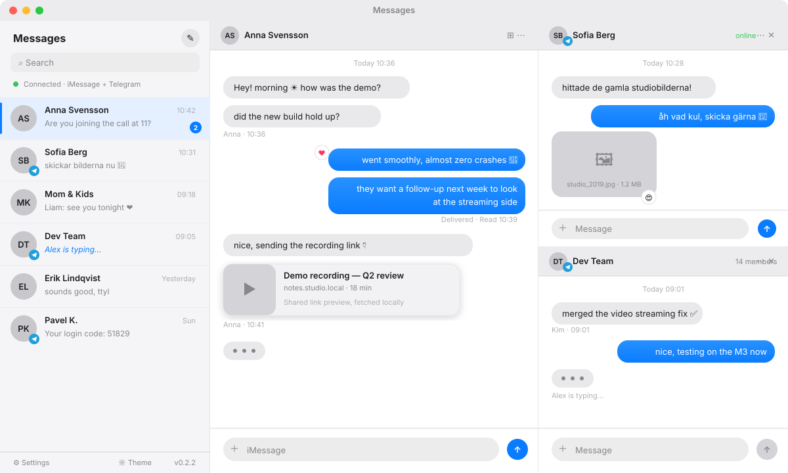

# Messages

[](https://github.com/oovets/imessage/releases/latest)
[](https://github.com/oovets/imessage/releases/latest)
[](https://tauri.app/)
[](https://react.dev/)



A native macOS desktop app that puts **iMessage and Telegram in one unified inbox**.
Conversations from both services live in a single chat list, sorted by time, with one
clean Messages-style interface. iMessage runs through a self-hosted
[BlueBubbles](https://bluebubbles.app) server; Telegram connects directly over MTProto.

This is a real Tauri 2 application, not a webpage in a wrapper. It installs into
`/Applications`, lives in the menu bar, launches at login, stores credentials in the macOS
Keychain, and delivers native notifications and deep links. A browser-served web build
exists for development, but the shipping product is the macOS desktop app.

**Stack:** Tauri 2, Rust, React, TypeScript, Vite, Tailwind, Zustand. The Telegram side is a
Cargo workspace of focused crates (`shared`, `database`, `cache`, `telegram-api`,
`telegram-core`) compiled into the same binary.

---

## Download

Grab the latest signed-for-your-own-machine build from the
[releases page](https://github.com/oovets/imessage/releases/latest). Pick the Apple Silicon
DMG on M-series Macs and the Intel DMG on older ones.

Release builds are currently unsigned. On first launch, see
[First run](#first-run) for clearing the Gatekeeper quarantine flag.

---

## Features

### Unified inbox

- One chat list interleaving iMessage and Telegram conversations, sorted by most recent
  activity.
- A consistent Messages-style interface across both services — same bubbles, same
  composer, same behavior.
- Source-specific code stays cleanly separated internally, but the user sees one app.

### iMessage (via BlueBubbles)

- Send and receive texts, replies, tapbacks, and image/video/file attachments.
- Optimistic outgoing rendering, deduped against server echoes.
- Inline downscaled image thumbnails with a full-size preview dialog; video plays inline;
  other attachments render as links.
- Rich link previews fetched locally through the Tauri HTTP plugin (no CORS workarounds).

### Telegram (via MTProto)

- Log in by phone number and code, or by QR, with two-factor password support.
- Multiple accounts.
- Messages, reactions, typing indicators, presence, and avatars.
- Media (photos, stickers, video, documents) fetched through an encrypted local cache and
  streamed from disk to keep memory low.
- Send messages and file attachments; edit, delete, and mark read.

### Desktop integration

- Real macOS app bundle: native menu, tray icon, dock presence, `Cmd+Q`.
- macOS Keychain-backed credential storage in release builds.
- Native desktop notifications for incoming messages.
- Launch at login and `messages://` deep links to jump straight to a chat.
- App-wide font scaling (`Cmd +`, `Cmd -`, `Cmd 0`), theme color editing, light/dark modes.
- Native window vibrancy and an overlay titlebar — frosted and draggable from the top.
- Emoji autocomplete (type a plain word like `fire` or a `:shortcode`) plus a searchable
  picker.
- Memory-conscious: bounded LRU message cache, downscaled image thumbnails, disk-streamed
  video.

---

## Requirements

**To run the app:**

- macOS (Apple Silicon or Intel).
- For iMessage: a reachable BlueBubbles server plus its URL and password/API key.
- For Telegram: nothing beyond your Telegram account — the app's API credentials are baked
  into official release builds.

**To build from source:** Rust stable, the Tauri 2 macOS prerequisites, Xcode command line
tools, and Node.js 24 with npm. The web build (development only) needs just Node.js 24 and
npm.

---

## Setting up the iMessage backend (BlueBubbles)

The BlueBubbles server is a macOS app that bridges iMessage to an HTTP/WebSocket API. It
must run on a Mac signed into iCloud with Messages working.

**Host requirements:** a Mac on macOS 11+, signed into iCloud with iMessage enabled and a
visible conversation; always-on power and network with sleep prevented; Full Disk Access
granted (to read the Messages SQLite database); Accessibility and Automation granted (to
send messages).

**Install:**

1. Download the latest server from [bluebubbles.app/server](https://bluebubbles.app/server)
   (or the GitHub releases).
2. Move `BlueBubbles.app` to `/Applications` and launch it.
3. Approve the prompts in System Settings → Privacy & Security → Full Disk Access, then
   Accessibility, then Automation (allow control of Messages and System Events).
4. Set a strong server password — this is the API password the client uses.
5. Choose a port (default `1234`) and start the server.
6. Optional: enable launch on startup and disable App Nap so it survives reboots.

**Exposing the server:** LAN-only use is `http://<mac-ip>:1234`. For remote access, use a
Cloudflare Tunnel (recommended; the server can publish a `*.trycloudflare.com` URL), ngrok
(from the server UI), or manual port-forwarding with dynamic DNS and TLS in front.

**Verify:**

```bash
curl -k "https://your-server/api/v1/server/info?password=YOUR_PASSWORD"
```

A JSON metadata payload confirms the API is reachable. Use that URL and password on first
run.

**Common pitfalls:** Messages must have launched and synced at least one iMessage chat;
"Messages in iCloud" should be on or old history is missing; macOS upgrades can reset
permissions (re-grant Full Disk Access and restart); prefer a real TLS certificate via
Cloudflare Tunnel for remote use.

---

## Setting up Telegram

Telegram requires an app-level `api_id` and `api_hash` (from
[my.telegram.org](https://my.telegram.org)) to connect over MTProto. These identify the
application, not your account.

**In official release builds** the credentials are baked into the binary at build time and
you can just log in — no setup required.

**When building from source or in CI**, supply them yourself. They are read at compile time
via `option_env!` and are never committed to the repository:

- For a local build, export them before building:

  ```bash
  export TG_API_ID=1234567
  export TG_API_HASH=your32characterapihashfromtelegram
  npm run tauri:build
  ```

- For GitHub Actions releases, add them as repository secrets named `TG_API_ID` and
  `TG_API_HASH` (Settings → Secrets and variables → Actions). The release workflow reads
  them as environment variables. If they are unset the app still builds and runs — just
  without Telegram.

**Logging in:** open Settings → Telegram and choose phone-number or QR login. Two-factor
passwords are supported, and you can add multiple accounts.

---

## First run

With no saved settings, the settings dialog opens automatically. Enter the BlueBubbles
server URL (for example `https://your-bluebubbles-server`) and its password/API key, and
optionally log in to Telegram.

Credential storage depends on the build:

- **Web / Tauri dev:** local dev storage, to avoid Keychain trust prompts from unsigned dev
  binaries.
- **macOS release:** the macOS Keychain, under the app's service identity, as a single
  consolidated entry. Clearing settings removes the current and legacy Keychain entries.

**Unsigned builds:** if macOS says the app "is damaged and can't be opened", move it to
`/Applications` and clear the quarantine flag:

```bash
xattr -dr com.apple.quarantine "/Applications/Messages Desktop.app"
```

---

## Building from source

```bash
npm install --legacy-peer-deps

npm run tauri:dev      # run the desktop app in development
npm run tauri:build    # produce a local .app and .dmg

# frontend-only (browser, no Rust shell rebuild)
npm run dev            # Vite dev server
npm run build          # type-check and build the frontend
```

### npm scripts

```
npm run dev          start the Vite dev server
npm run build        type-check and build the frontend
npm run lint         ESLint flat config
npm run test         Vitest unit tests
npm run preview      preview the built frontend
npm run tauri:dev    run the desktop app in development
npm run tauri:build  build local desktop bundles
```

### Local cross-architecture builds

On Apple Silicon, add the Intel target first:

```bash
rustup target add x86_64-apple-darwin
npm run tauri:build -- --target x86_64-apple-darwin --bundles app,dmg   # Intel
npm run tauri:build -- --target aarch64-apple-darwin --bundles app,dmg  # Apple Silicon
```

### Verification before shipping

```bash
npm run lint
npm run test
npm run build
cd src-tauri && cargo check
npm run tauri:build     # for desktop packaging changes
```

---

## Local code signing

Unsigned local builds re-trigger the macOS Keychain trust prompt on every launch — the
Keychain cannot remember "always allow" without a stable code signature. `npm run
tauri:build` signs the bundle with a stable identity to silence this.

Create the signing certificate once:

- Keychain Access → Certificate Assistant → Create a Certificate
- Name: `Messages Desktop Signing`, identity type: self-signed root, type: code signing

The `tauri:build` script reads `APPLE_SIGNING_IDENTITY` and defaults to
`Messages Desktop Signing`. Override it with your own certificate name, or use `-` for an
ad-hoc (unsigned) build:

```bash
APPLE_SIGNING_IDENTITY="Apple Development: you@example.com" npm run tauri:build
APPLE_SIGNING_IDENTITY="-" npm run tauri:build
```

After the first launch of a signed build, click "always allow" once; the stable signature
means it will not ask again, even after future rebuilds. GitHub Actions release builds are
independent of this.

---

## Releases and CI

macOS releases are built by GitHub Actions from `v*` tags:

- **Apple Silicon:** `aarch64-apple-darwin` on `macos-latest`
- **Intel:** `x86_64-apple-darwin` on `macos-13`

Tag a release and push it:

```bash
git tag v0.2.1
git push origin v0.2.1
```

The workflow builds both architectures, bakes in the Telegram credentials from the
`TG_API_ID` / `TG_API_HASH` secrets, and publishes the `.dmg` and `.app` to a GitHub
Release.

Release builds are unsigned unless Apple signing and notarization secrets (a Developer ID
certificate, `APPLE_ID`, an app-specific password, and `APPLE_TEAM_ID`) are added to the
repository. Without them, other users must clear the quarantine flag manually — see
[First run](#first-run).

---

## Project structure

```
.github/workflows/   GitHub Actions release workflow
src/                 React application
  api/               BlueBubbles API client
  components/        UI and chat components
  hooks/             realtime, polling, desktop, and Telegram hooks
  lib/               utilities, appearance, secure config, previews, WS transport
  store/             Zustand app state (unified chat list, bounded message cache)
  telegram/          Telegram types, API bindings, adapters, media components
  types/             shared TypeScript types
crates/              Telegram Rust workspace
  shared/            domain model, events, config, ids
  database/          SQLite persistence and migrations
  cache/             encrypted blob cache and Keychain secret store
  telegram-api/      MTProto boundary
  telegram-core/     sync engine and services
src-tauri/           Tauri 2 desktop shell (Rust commands, capabilities, icons)
scripts/             dev helpers
```

---

## How it works

**Unified chat list.** Both sources write into a single `chats` array in the Zustand store,
each updating only its own slice, and the list is sorted by a shared activity timestamp. The
UI never renders directly from network responses — data lands in the store (and, for
Telegram, SQLite) first, then the list re-reads.

**iMessage realtime and sync.** Connects to the BlueBubbles socket.io-compatible WebSocket
and falls back to HTTP polling. HTTP and WebSocket both go through the Tauri plugins on the
Rust side, so development reaches a cleartext LAN server without webview ATS/CORS blocks.

**Telegram sync.** SQLite is the source of truth for the UI. The sync engine writes network
data into the database and emits a domain event, which the webview receives as a
`tg:core-event`; the UI re-reads from state. Cold start renders from disk; the network only
updates state. Core initialization runs off the main thread, emitting `tg:ready` when done.

**Media handling.** Attachments are fetched on the Rust side and streamed from a temp file
via the asset protocol, so large videos never cross the IPC boundary or sit in memory.
Telegram media is decrypted from a local encrypted cache; downloads are throttled by a
shared semaphore to avoid rate limits.

**Credentials.** All secrets live in the macOS Keychain as a single consolidated entry in
release builds; the web and Tauri dev builds use in-memory or local dev storage.

**Deep links.** `messages://chat/<guid>` and `messages://open?chat=<guid>` open a specific
conversation.

---

## Dev diagnostics

Memory work has two dev-only helpers. In a dev build, the web inspector console exposes
`window.__mem()` (JS heap, DOM nodes, cached message counts) and `window.__memRec`
(start / mark / stop / dump a scenario walkthrough as a table and CSV).
`scripts/mem-snapshot.sh` prints the matching RSS for the Rust process and its WKWebView
content process — diff before and after launch to find the app's renderer PID:

```bash
scripts/mem-snapshot.sh before   # before launching the app
scripts/mem-snapshot.sh after    # the new WebContent pid is the app's
```

---

## Troubleshooting

**Keychain prompts.** Dev builds avoid the Keychain (dev storage). Unsigned release builds
re-prompt every launch; sign locally so "always allow" sticks — see
[Local code signing](#local-code-signing).

**DMG build "resource busy".** A temp app from a mounted DMG blocks `hdiutil detach`. Quit
it, eject the temp volume, and rerun `npm run tauri:build`.

**Self-signed server certificate.** Open the BlueBubbles server URL in a browser first and
accept the certificate.

**Unsigned release warning.** Gatekeeper may require manual approval; add Apple signing and
notarization secrets to GitHub Actions before wider distribution.

**Telegram won't connect.** Confirm the build has `TG_API_ID` / `TG_API_HASH` baked in
(official releases do; source builds need them exported or set as CI secrets — see
[Setting up Telegram](#setting-up-telegram)).
